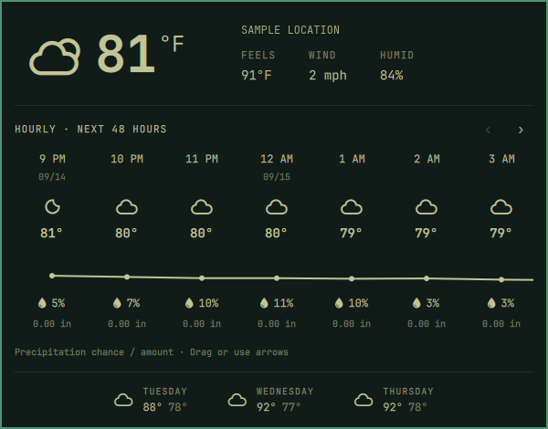

# Just Right Weather

Not a weather dashboard. Not just a temperature. Just the right amount of weather
for the Omarchy bar.

Built on Omarchy's default weather widget, with a slightly wider popup and a few
useful additions:

- Current conditions, feels-like temperature, wind, and humidity.
- A scrollable 48-hour timeline with temperatures and a temperature graph.
- Hourly precipitation probability and amount, in inches or millimeters.
- Sunrise and sunset inserted chronologically at their exact local times.
- The next three days, with conditions and high/low temperatures.



The preview is cropped to the widget, with the location replaced and image
metadata stripped. Colors, fonts, spacing, corners, and the popup surface follow
the active Omarchy theme and bar settings; the pictured palette is not hard-coded.

## Requirements

An Omarchy installation with the Quattro shell and `omarchy plugin` commands.
This is a Quickshell plugin, not a Waybar module.

The plugin uses the shell's `qs.Commons` and `qs.Ui` components, Qt Quick,
Quickshell I/O, `curl`, and the existing Omarchy commands
`omarchy-weather-location`, `omarchy-weather-status`, and
`omarchy-notification-send`. The location command also uses `jq`. These are
provided by a normal compatible Omarchy installation.

Device location is optional and requires Qt Positioning (Arch package
`qt6-positioning`) and a working, permission-granted positioning backend.
Without it, use city search, US ZIP search, or coordinate entry. Device location
may be network-based; it is not guaranteed to be GPS.

An internet connection is needed for weather and place searches. No API key,
installer script, remote build, extra service, or administrator privileges are
required. The plugin runs inside the existing Omarchy shell, never in a second
Quickshell process. Like all Omarchy plugins, it runs unsandboxed with your user
permissions.

## Install

```sh
omarchy plugin add https://github.com/daniellopez12/just-right-weather.git --enable
```

The permanent plugin ID is `io.github.daniellopez12.just-right-weather`.
It is a standalone bar widget, not an override of `omarchy.weather`; installing
it does not disable your existing weather widget. If both appear, disable the
old widget explicitly through Omarchy's plugin controls.

Move it to your preferred bar section:

```sh
omarchy bar move io.github.daniellopez12.just-right-weather --section center
```

## Usage

Click the weather icon to toggle the popup; press Escape to close it. Drag the
hourly strip horizontally or use its on-screen arrows to move four entries at
a time. Solar events appear between the relevant hourly forecasts, with minute
precision. Hourly dates and times refer to the forecast location.

Middle-click the bar icon to refresh. Right-click shows the standard Omarchy
weather notification. Press Tab / Shift+Tab to switch between bar panels.

Click the location label, or press Enter with the popup open, to choose a
location. Search for a city or US ZIP, or paste `latitude, longitude`, then
select a result. ZIP coordinates are approximate area centers. "Use device
location" requests a position only when clicked; select the returned result to
save it. "View saved pin on map" opens OpenStreetMap in your browser.

The clear button returns to IP-based location detection.

**Location is shared with Omarchy's built-in weather widget.** Saving or clearing
a location explicitly changes that shared preference. Installation itself does
not write a location, change a theme, or replace your other settings.

When a refresh fails, the last hourly forecast remains visible with a warning.
Missing hourly values appear as dashes rather than zero rainfall.

The shell lifecycle commands use the permanent ID:

```sh
omarchy-shell shell summon io.github.daniellopez12.just-right-weather '{}'
omarchy-shell shell hide io.github.daniellopez12.just-right-weather
```

## Configure

Settings belong on this widget's existing entry in
`~/.config/omarchy/shell.json`. For example, replace just its string entry in a
bar section with the following object; do not replace your whole configuration:

```json
{
  "id": "io.github.daniellopez12.just-right-weather",
  "unit": "metric",
  "refreshMinutes": 15
}
```

`unit` accepts `metric` or `imperial`; omitting it uses the detected country,
falling back to your locale. Temperature, feels-like temperature, wind, and
precipitation amounts follow this setting. `refreshMinutes` defaults to 15 and
has a minimum of 1. The hourly timeline advances while the popup is open.

## Privacy and network access

The repository includes no personal saved location, postal code, coordinates, API keys,
personal configuration, weather cache, or original desktop screenshot. Test data
is synthetic. It does not collect analytics or send data to the author.

Weather cannot be fetched without disclosing a location to weather providers.
The plugin reuses your local
`~/.local/state/omarchy/settings/weather.json`, which is outside the plugin and
is never bundled. Without a configured location, wttr.in estimates one from
your public IP address.

| Service | When contacted | Information sent |
| --- | --- | --- |
| [wttr.in](https://wttr.in) | Weather refresh; IP auto-detection when no location is set | Configured coordinates or place name, or your public IP for auto-detection |
| [Open-Meteo](https://open-meteo.com) | Current, hourly, and daily forecasts | Forecast latitude and longitude |
| [Open-Meteo Geocoding](https://open-meteo.com/en/docs/geocoding-api) | City searches in the location editor | Search text |
| [Zippopotam.us](https://www.zippopotam.us) | US ZIP searches | The five-digit ZIP being searched |
| [OpenStreetMap](https://www.openstreetmap.org) | Only when you click the map button | The saved coordinates, opened in your browser |

All network services also receive your public IP address. Your device's
positioning backend may use its own network services and permissions.
Coordinates obtained from it are not sent to the weather providers until you
select that result.

## Disable or remove

```sh
omarchy plugin disable io.github.daniellopez12.just-right-weather
omarchy plugin remove io.github.daniellopez12.just-right-weather
```

Removal leaves the shared Omarchy weather location intact. If you explicitly
disabled the built-in weather widget earlier, restore it with:

```sh
omarchy plugin enable omarchy.weather --section center
```

## Security update: 1.0.1

Version 1.0.1 prevents external forecast and location text from being interpreted
as HTML that could trigger unintended image requests. Rain probability accepts
only finite numbers between 0 and 100; invalid values display as unavailable.
Users of 1.0.0 should update:

```sh
omarchy plugin update io.github.daniellopez12.just-right-weather
```

## Development

Keep development in a user-owned folder, never in `/usr/share/omarchy`.
From the repository root:

```sh
omarchy plugin validate .
qmllint -I "$OMARCHY_PATH/shell" \
  BarWidget.qml Panel.qml HourlyForecast.qml DeviceLocation.qml
node --test tests/model.test.cjs
```

On Arch, `qmllint` may be at `/usr/lib/qt6/bin/qmllint` instead of on `PATH`.
The optional device-location file requires the Qt Positioning import to lint.
The model tests use Node's built-in test runner, with no package installation.

Follow the [Omarchy development guide](https://plugins.omarchy.org/develop.html)
and [publishing guide](https://plugins.omarchy.org/publish.html).

## Credits and license

Derived from the [Omarchy weather widget](https://github.com/omacom/omarchy/tree/quattro/shell/plugins/panels/weather),
retaining its MIT copyright notice. Custom hourly timeline and location
enhancements are also MIT licensed; see [LICENSE](LICENSE).

Weather data is provided by wttr.in and Open-Meteo. Open-Meteo weather data is
offered under [CC BY 4.0](https://creativecommons.org/licenses/by/4.0/); its
geocoding data is based on GeoNames. Provider data and service terms are
separate from this plugin's MIT code license.
